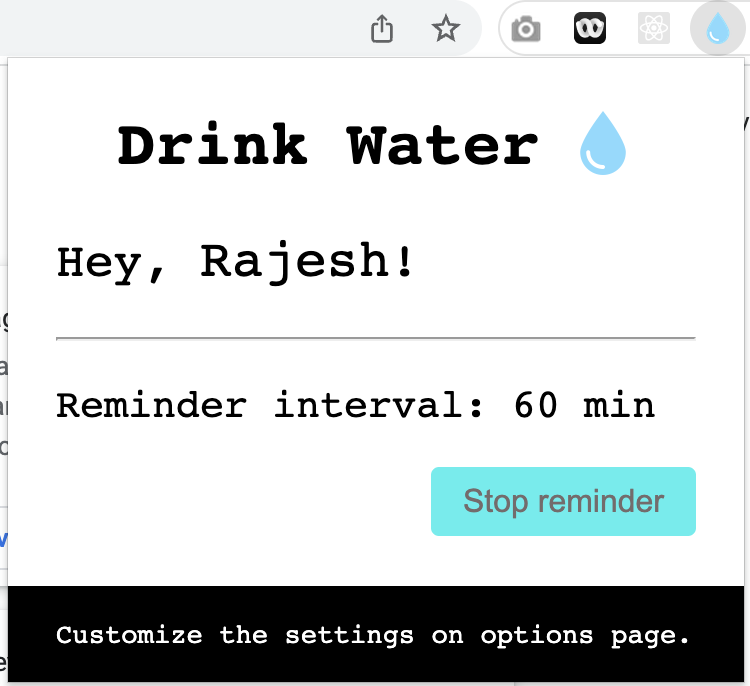
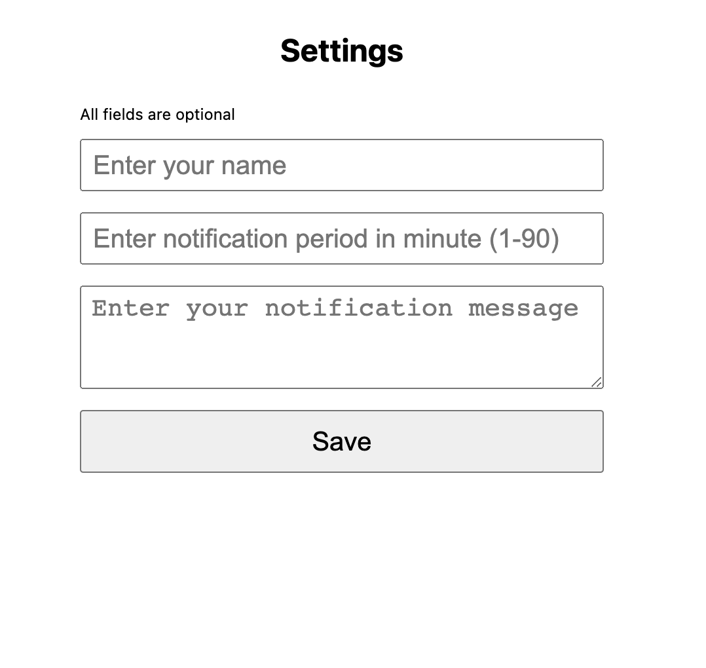

# Drink Water

A simple water intake reminder extension for chrome.

## Build

```
npm run build
```

## Load unpack

- Open `chrome://extensions`
- Switch on **Developer mode** (top right)
- Click on **Load unpacked** (top left) and upload the dist folder
- Switch off **Developer mode**

## Play with the extension

- Click the extension to see the settings and control.
- Right click and select `options` to set your name, custom message and notification period.



